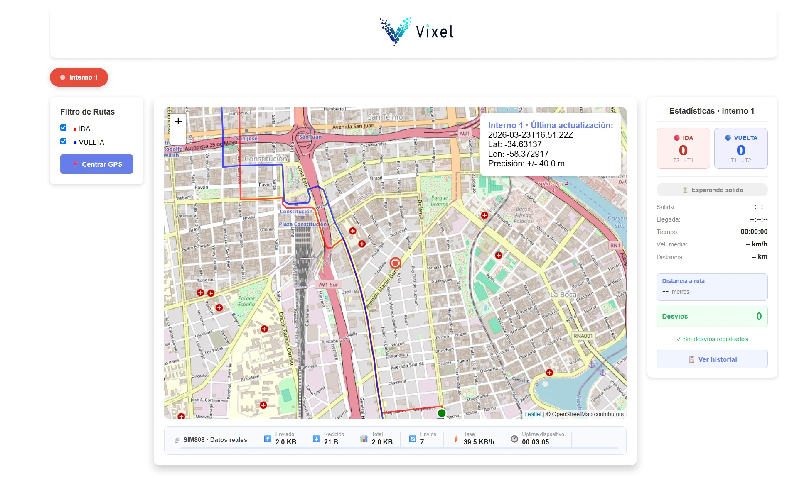

# Requerimientos Funcionales y Alcance del Proyecto

**Sistema de rastreo y cartelería inteligente para colectivos — Línea 102 (Vixel)**

## 1. Resumen ejecutivo

Vixel está desarrollando un sistema a bordo para colectivos urbanos que rastrea
la posición del vehículo en tiempo real, anuncia automáticamente por voz y en
un cartel la próxima parada, y está pensado para crecer hacia una plataforma
más amplia de comunicación y monitoreo para empresas de transporte.

## 2. Alcance actual (piloto)

- Línea 102, Ramal A.
- Prueba en un colectivo real, con el hardware de rastreo y anuncio de
  paradas ya armado.
- Objetivo del piloto: validar en condiciones reales el rastreo de posición,
  el anuncio automático de paradas, y que el volumen del audio alcance para
  escucharse dentro del colectivo en movimiento.

## 3. Actores del sistema

- **Pasajero**: recibe la información de la próxima parada (audio y cartel),
  y a futuro tendrá acceso a conexión a internet a bordo.
- **Chofer**: a futuro, recibe avisos operativos de la central en una
  pantalla y puede confirmar que los leyó.
- **Central / despachante**: monitorea la ubicación de cada colectivo y,
  a futuro, puede enviarle avisos al chofer.
- **Administrador de flota (Vixel)**: ajusta parámetros de funcionamiento de
  forma remota, sin necesidad de intervenir cada unidad físicamente.

## 4. Requerimientos funcionales por etapa

### Etapa 1 — Rastreo y anuncio inteligente de paradas
*(desarrollada, en prueba sobre un colectivo real)*

- Reportar la posición del colectivo en tiempo real a una plataforma central.
- Reconocer automáticamente cuándo el colectivo se aproxima a una parada
  configurada.
- Anunciar por voz la parada próxima, con volumen suficiente para
  escucharse dentro del colectivo en movimiento.
- Permitir ajustar el volumen y otros parámetros de forma remota, sin
  reprogramar el dispositivo.
- Registrar métricas básicas de funcionamiento (consumo de datos, tiempo
  activo) para control operativo.

### Etapa 2 — Cartel visual de parada
*(desarrollada)*

- Mostrar en un cartel visible el nombre de la próxima parada al momento
  del anuncio.
- Volver a mostrar un texto por defecto (por ejemplo, el número de línea)
  cuando no hay un anuncio activo.

### Etapa 3 — Publicidad rotativa en el cartel
*(diseñada, pendiente de desarrollo)*

- Mostrar contenido publicitario o institucional en el cartel interior
  cuando no hay un anuncio de parada activo.
- El anuncio de la próxima parada siempre tiene prioridad: interrumpe la
  publicidad en curso, se muestra, y la publicidad se reanuda después.
- Administrar el contenido publicitario a mostrar desde el mismo panel
  central pensado para los avisos al chofer (Etapa 5), sin necesidad de
  intervenir cada colectivo físicamente.
- Esta etapa depende de que exista el panel central de mensajería de la
  Etapa 5, por eso su desarrollo queda pendiente hasta entonces.

### Etapa 4 — Conectividad a bordo
*(diseñada, pendiente de desarrollo)*

- Ofrecer conexión a internet inalámbrica a los pasajeros dentro del
  colectivo.
- Aprovechar esa misma conexión para el sistema de rastreo, evitando
  depender de más de una línea de datos por vehículo.
- Mantener separada la red de pasajeros de la red del sistema de rastreo,
  por seguridad y estabilidad.

### Etapa 5 — Comunicación con el chofer
*(diseñada, pendiente de desarrollo)*

- Permitir que la central envíe avisos breves (por ejemplo, desvíos o
  novedades de tránsito) que el chofer vea en una pantalla a bordo.
- Permitir que el chofer confirme la recepción de un aviso con una sola
  acción simple.
- Alertar sonoramente al chofer cuando llega un aviso nuevo.
- Darle a la central un panel para ver el historial de avisos enviados y
  las confirmaciones recibidas, con acceso por usuario.

### Etapa 6 — Monitoreo de controles del colectivo
*(documentada, desarrollo pospuesto a propósito)*

- Informar el estado de los controles eléctricos del colectivo — por
  ejemplo, si un control fue accionado y si efectivamente respondió.
- Alertar cuando un control no responde como se esperaba, para facilitar
  el mantenimiento preventivo.
- Esta etapa depende de que la Etapa 5 esté implementada, por eso su
  desarrollo queda pospuesto hasta entonces.

## 5. Requerimientos generales del sistema

- **Autonomía**: debe encender y empezar a funcionar solo al arrancar el
  colectivo, sin que nadie tenga que intervenir manualmente.
- **Disponibilidad**: debe seguir funcionando de forma confiable durante
  toda la jornada del colectivo.
- **Escalabilidad**: el diseño debe permitir sumar más colectivos, más
  líneas y más empresas de transporte clientas sin rehacer el sistema
  desde cero.
- **Facilidad de mantenimiento**: los parámetros de funcionamiento
  (volumen, textos, tiempos) deben poder ajustarse de forma remota.
- **Costo por unidad**: las decisiones de diseño deben tener en cuenta el
  costo al momento de escalar a una flota completa.

## 6. Fuera de alcance (por ahora)

- Cobro de pasajes o integración con sistemas de boletería.
- Videovigilancia o cámaras a bordo.
- Video o imágenes de alta resolución en el cartel interior: por su
  tamaño y resolución, el cartel está pensado para texto y gráficos
  simples, no para reproducir video.
- Cualquier funcionalidad no descripta en este documento.

## 7. Panel web de seguimiento en tiempo real

Ya existe y está en uso un panel web para la central / despachante, con la
posición de cada colectivo en un mapa en vivo. A continuación se muestra
una captura y el detalle de toda la información que ofrece hoy.

**Datos que muestra el panel:**

- **Ubicación en el mapa**: cada colectivo aparece como un marcador sobre
  el mapa, en su posición actual.
- **Al tocar un colectivo en el mapa**: nombre del colectivo, hora de la
  última actualización recibida, latitud, longitud, y la precisión
  estimada de esa ubicación (en metros).
- **Selector de colectivos**: permite elegir qué colectivo (o colectivos)
  de la flota se están viendo en el mapa en un momento dado.
- **Filtro por sentido de recorrido**: permite mostrar solo los viajes de
  ida, solo los de vuelta, o ambos, cada uno identificado con un color
  distinto en el mapa.
- **Botón para centrar el mapa** automáticamente sobre la posición del
  colectivo seleccionado.
- **Estado del viaje en curso**: un indicador que muestra si el colectivo
  está esperando salida, en viaje de ida, en viaje de vuelta, o si acaba
  de completar un viaje.
- **Datos del viaje actual**: hora de salida, hora de llegada (cuando
  corresponde), tiempo transcurrido, velocidad promedio y distancia
  recorrida.
- **Control de desvíos de ruta**: qué tan lejos está el colectivo de su
  recorrido habitual, y un contador de desvíos detectados durante el
  viaje, con el horario y la distancia de cada uno.
- **Consumo de datos del dispositivo**: cuántos datos envió y recibió el
  equipo instalado en el colectivo, cuántos reportes mandó, a qué
  velocidad está consumiendo datos, y hace cuánto tiempo está encendido
  de forma continua (sin cortes).
- **Historial de viajes**: un listado con todos los viajes anteriores de
  cada colectivo — fecha, horario, unidad, sentido (ida/vuelta),
  duración, velocidad promedio, distancia recorrida y desvíos
  registrados — con la opción de borrar ese historial.

## 8. Estado actual

| Etapa | Estado |
|---|---|
| 1 — Rastreo y anuncio de paradas | Desarrollada, en prueba real |
| 2 — Cartel visual | Desarrollada |
| 3 — Publicidad rotativa en el cartel | Diseñada, pendiente |
| 4 — Conectividad a bordo | Diseñada, pendiente |
| 5 — Comunicación con el chofer | Diseñada, pendiente |
| 6 — Monitoreo de controles | Documentada, pospuesta |
